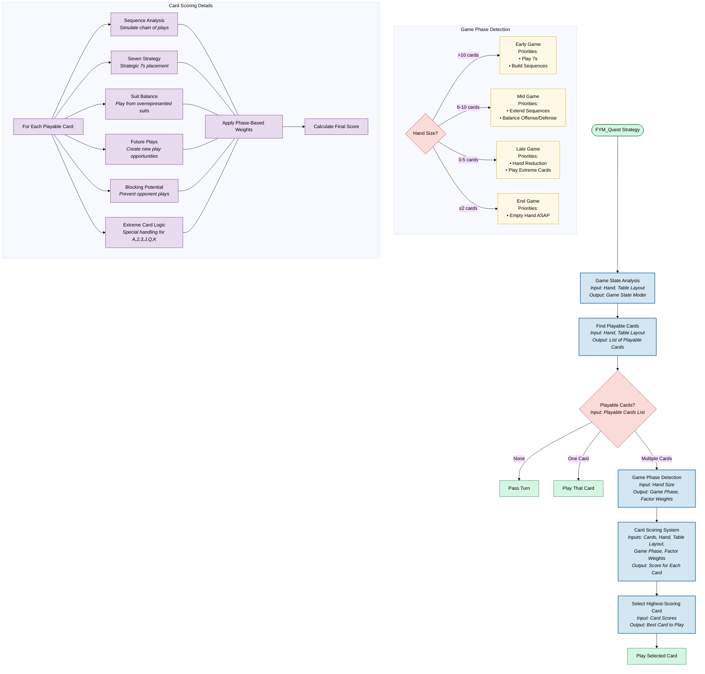
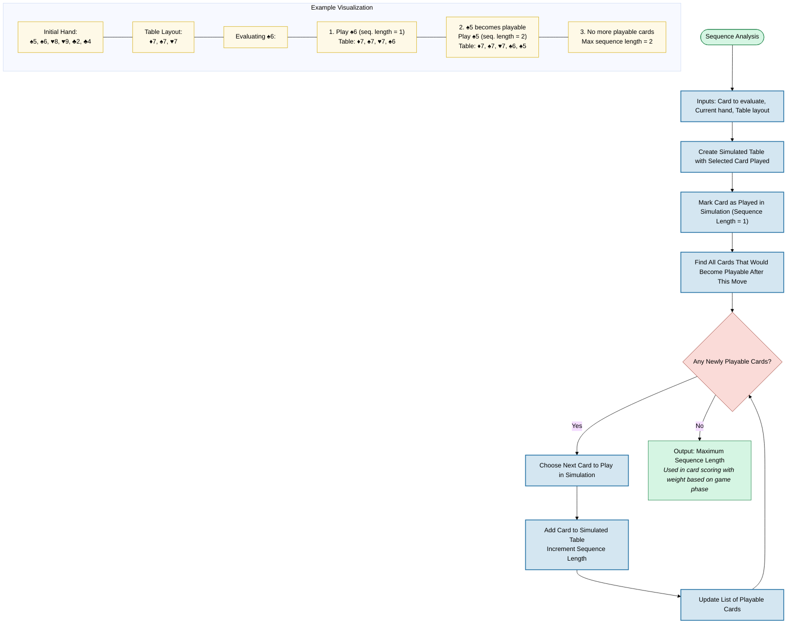
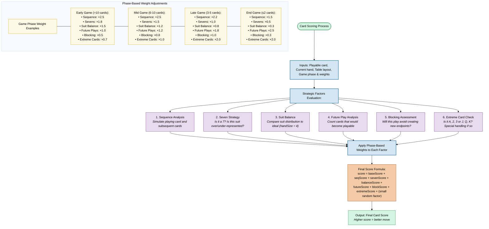

# Sevens Card Game - FYM Quest Strategy

## Team Members
- Faycal CHEMLI
- Yasser BOUHAI
- Mohamed LAJIMI

## Project Overview
This project implements a competitive strategy for the classic Sevens card game. Sevens is a trick-avoidance game where players strategically play cards according to specific rules:

- The game starts with the 7 of Diamonds on the table
- Players can only play cards that meet certain conditions:
  - 7s can be played only if not already on the table
  - Cards higher than 7 can be played if the card with rank-1 is on the table
  - Cards lower than 7 can be played if the card with rank+1 is on the table
- The first player to empty their hand wins the round
- Over multiple rounds, players accumulate cards left in their hands as penalty points
- The player with the lowest accumulated points wins the game

Our FYM_Quest strategy employs an adaptive, multi-factor decision system that consistently outperforms both random and greedy approaches by using sophisticated analysis and forward-looking simulation.

## Strategy Implementation

Our strategy follows a comprehensive decision process that analyzes the game state, identifies playable cards, and selects the optimal move based on multiple strategic factors that adapt as the game progresses.



### Key Innovation: Sequence Analysis

A key innovation in our approach is the sequence analysis system that simulates potential card sequences to identify moves that enable the longest chain of consecutive plays. This forward-looking simulation gives our strategy a significant advantage over simpler approaches that only consider the immediate game state.



### Adaptive Card Scoring System

Each potential move is evaluated using six strategic factors, weighted according to the current game phase. This sophisticated scoring system enables our strategy to adapt its priorities as the game evolves, optimizing decision-making for each situation.



## Strategy Justification

We chose this approach for several reasons:

1. **Forward-Looking Planning**: By simulating potential sequences of plays, our strategy can identify moves that might not seem optimal in the immediate term but lead to better long-term outcomes.

2. **Adaptive Gameplay**: Different phases of the game require different strategic priorities. Our phase-based weight adjustment system ensures the strategy shifts its focus appropriately as the game progresses.

3. **Multi-Factor Analysis**: Rather than relying on a single heuristic, our strategy combines multiple strategic factors to make more balanced decisions that consider various aspects of gameplay.

4. **Opponent Awareness**: The blocking potential assessment allows our strategy to play defensively in multiplayer games, preventing opponents from emptying their hands quickly.

5. **Suit Balance Optimization**: By considering the distribution of suits in hand, our strategy can prioritize playing from overrepresented suits, increasing the chances of emptying the hand efficiently.

## Sample Performance


Our FYM_Quest strategy consistently outperforms both random and greedy approaches across multiple test games, demonstrating its effectiveness in various game scenarios.

## Important Notes

1. **Our Strategy and Code Files**: The `code_skeleton` directory contains all the code files, including our team's custom strategy (`FYM_Quest.cpp`), the test strategies (Random and Greedy), and all framework files.

2. **Cross-Platform Support**:
   * The project has been compiled for both Linux (`.so` files, `sevens_game` executable) and Windows (`.dll` files, `sevens_game.exe` executable)
   * Our strategy (`FYM_Quest.so`/`.dll`) and the main executables are in the root directory
   * The test strategies (random and greedy) are in the `testing` directory

3. **Compilation**:
   * Use `compile.sh` (Linux) or `compile.bat` (Windows) in the root directory to recompile the project if needed
   * These scripts will compile:
     * The main game executable (`sevens_game`/`sevens_game.exe`) in the root
     * Our team strategy (`FYM_Quest.so`/`FYM_Quest.dll`) in the root
     * The test strategies in the testing directory

4. **Running the Game**:
   * From the root directory, run our strategy against the test strategies using:
     
     For Linux:
     ```
     ./sevens_game competition FYM_Quest.so testing/random_strategy.so testing/greedy_strategy.so
     ```
     
     For Windows:
     ```
     sevens_game.exe competition FYM_Quest.dll testing\random_strategy.dll testing\greedy_strategy.dll
     ```

## Limitations and Future Improvements

While our strategy performs well, there are several areas for potential improvement:

1. **Enhanced Opponent Modeling**: More sophisticated tracking of opponent play patterns could improve defensive play.

2. **Dynamic Weight Adjustment**: The current phase-based weight system could be extended to adjust weights based on observed gameplay patterns.

3. **Machine Learning Integration**: A future version could use reinforcement learning to optimize the weights for different game situations.

4. **Performance Optimization**: The sequence analysis could be optimized to handle longer sequences without significant computational overhead.

## Acknowledgements

We would like to acknowledge:
- The card game framework provided by our instructors
- Research on optimal play in trick-taking card games that informed our strategy design
- Our C++ Advanced Programming course for providing the opportunity to work on this challenging project
